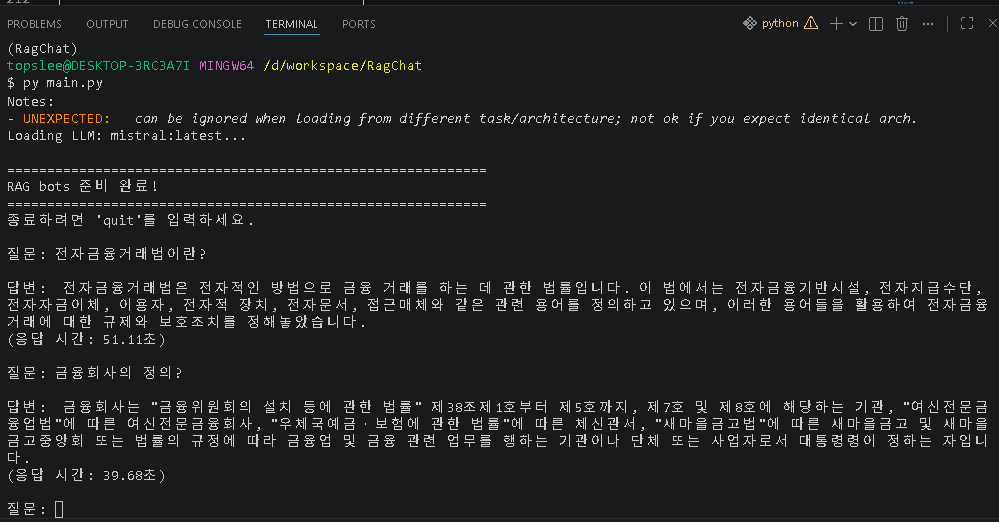

# 📚 전자금융거래법 RAG 챗봇

> RAG(Retrieval-Augmented Generation) 기반 전자금융거래법 전문 AI 챗봇
> 
> 로컬 LLM(Ollama)을 활용한 법률 문서 검색 및 답변 시스템

[](https://www.python.org/)
[](LICENSE)
[](https://python.langchain.com/)

<div align="center">



**실제 챗봇 실행 화면**

</div>

---

## 🎯 프로젝트 개요

이 프로젝트는 **전자금융거래법** 문서를 활용하여 사용자의 법률 관련 질문에 정확한 답변을 제공하는 RAG 기반 AI 챗봇입니다.

### 핵심 특징
- ✅ **로컬 LLM**: Ollama를 사용한 프라이빗 환경
- ✅ **정확한 검색**: 코사인 유사도 기반 문서 검색
- ✅ **출처 명시**: 조항 번호를 포함한 신뢰할 수 있는 답변
- ✅ **VRAM 최적화**: 4GB 환경에서 실행 가능
- ✅ **한국어 최적화**: 한국어 특화 임베딩 모델 사용

### 목표
1. RAG 파이프라인 구축 역량 습득
2. 벡터 데이터베이스 실무 활용
3. 로컬 LLM 운영 노하우 확보
4. 문서 임베딩 및 검색 시스템 이해

---

## 🛠 기술 스택

| 분류 | 기술 | 설명 |
|------|------|------|
| **LLM 엔진** | [Ollama](https://ollama.ai/) | 로컬 LLM 실행 환경 |
| **LLM 모델** | Mistral 7B | 성능과 VRAM 최적화된 모델 |
| **프레임워크** | [LangChain](https://python.langchain.com/) | RAG 파이프라인 구성 |
| **벡터 DB** | [Chroma](https://www.trychroma.com/) | 로컬 벡터 데이터베이스 |
| **임베딩 모델** | [jhgan/ko-sroberta-multitask](https://huggingface.co/jhgan/ko-sroberta-multitask) | 한국어 최적화 임베딩 |
| **언어** | Python 3.9+ | 메인 프로그래밍 언어 |

---

## 📋 요구사항

### 하드웨어
- **RAM**: 8GB 이상 (권장 16GB)
- **VRAM**: 4GB 이상
- **디스크**: 10GB 이상 (모델 + 벡터 DB)

### 소프트웨어
- Python 3.9+
- [Ollama](https://ollama.ai/) (설치 및 실행)
- pip 또는 uv (패키지 관리)

---

## 🚀 시작하기

### 1️⃣ 저장소 클론

```bash
git clone https://github.com/yourusername/RagChat.git
cd RagChat
```

### 2️⃣ Python 가상환경 설정

```bash
# 가상환경 생성
python -m venv .venv

# 가상환경 활성화
# Windows
.venv\Scripts\activate

# macOS/Linux
source .venv/bin/activate
```

### 3️⃣ 의존성 설치

**pip 사용:**
```bash
pip install -r requirements.txt
```

**uv 사용 (빠름):**
```bash
uv pip install -r requirements.txt
```

### 4️⃣ Ollama 설치 및 모델 다운로드

**Ollama 설치:**
- [ollama.ai](https://ollama.ai/) 에서 다운로드

**Mistral 모델 다운로드:**
```bash
ollama pull mistral:latest
```

**Ollama 서버 시작 (새 터미널):**
```bash
ollama serve
```

### 5️⃣ 벡터 DB 생성 (처음 1회만)

```bash
# 임베딩 모델 다운로드 및 벡터 DB 생성
python src/vectorstore.py
```

**예상 시간:** 5~10분 (처음 실행시 모델 다운로드 포함)

### 6️⃣ 챗봇 실행

```bash
python main.py
```

**또는:**
```bash
py main.py
```

---

## 💬 사용 방법

### 대화형 모드

```bash
python main.py
```

### 실행 화면 예시


위 이미지는 실제 챗봇 실행 화면입니다:

```bash
$ python main.py

============================================================
전자금융거래법 RAG 챗봇
============================================================

RAG 체인 로딩 중...
Loading vector store...
Loading LLM: mistral:latest...

============================================================
챗봇 준비 완료!
============================================================
종료하려면 'quit'를 입력하세요.

질문: 전자금융거래란 무엇인가요?

답변: 제2조에 따르면, '전자금융거래'란 금융거래의 당사자가 
전자적 수단을 이용하여 행하는 금융거래를 의미합니다.
예를 들어, 인터넷 뱅킹, 모바일 뱅킹, 전자지급수단을 
이용한 결제 등이 해당됩니다.

(응답 시간: 2.34초)

질문: quit
감사합니다. 종료합니다.
```

### 테스트 질문

```
1. 전자금융거래란 무엇인가요?
2. 전자지급수단의 종류는 무엇이 있나요?
3. 전자금융업의 등록 요건은?
4. 전자금융거래 위반 시 처벌은?
5. 정보보호시스템의 인증 기준은?
```

---

## 📁 프로젝트 구조

```
RagChat/
├── src/                          # 소스 코드
│   ├── __init__.py
│   ├── loader.py                 # PDF 문서 로더
│   ├── splitter.py               # 텍스트 청킹
│   ├── embedding.py              # 임베딩 모듈
│   ├── vectorstore.py            # 벡터 DB 생성/관리
│   ├── retrieval.py              # 문서 검색
│   ├── chain.py                  # RAG 체인 (핵심)
│   └── prompts.py                # 프롬프트 템플릿
│
├── data/
│   ├── raw/                      # 원본 PDF 문서
│   │   └── 전자금융거래법.pdf
│   └── chroma_db/                # 벡터 데이터베이스 (생성됨)
│
├── config/                       # 설정 파일
├── tests/                        # 테스트 코드
│
├── main.py                       # 메인 실행 파일
├── requirements.txt              # Python 의존성
├── .gitignore
├── README.md                     # 이 파일
├── explain.md                    # RAG 파이프라인 상세 설명
├── context.md                    # 프로젝트 컨텍스트
└── development_plan.md           # 개발 계획
```

---

## 🔄 RAG 파이프라인 아키텍처

```
┌─────────────────────────────────────┐
│   OFFLINE 구축 단계 (한 번만)      │
└─────────────────────────────────────┘
         ↓
    [PDF 문서]
         ↓
  [청킹 - 500 토큰]
         ↓
  [임베딩 - 768차원]
         ↓
  [벡터 DB 저장]
         ↓
┌─────────────────────────────────────┐
│   ONLINE 질의 단계 (매번)          │
└─────────────────────────────────────┘
         ↓
  [사용자 질문]
         ↓
  [질문 임베딩]
         ↓
  [유사도 검색 - Top-3]
         ↓
  [컨텍스트 추출]
         ↓
  [프롬프트 구성]
         ↓
  [LLM (Mistral) 답변 생성]
         ↓
    [최종 답변]
```

---

## ⚙️ 설정 및 최적화

### 주요 파라미터

**src/chain.py:**
```python
LLM_MODEL = "mistral:latest"      # LLM 모델
EMBEDDING_MODEL = "jhgan/ko-sroberta-multitask"  # 임베딩 모델
```

**검색 설정:**
```python
search_kwargs={"k": 3}             # 상위 3개 문서 반환
```

**LLM 설정:**
```python
temperature=0                      # 결정론적 답변 (법률에 최적)
base_url="http://localhost:11434"  # Ollama 서버 주소
```

### 최적화 팁

#### 1. 청킹 크기 조정
```python
# src/splitter.py
chunk_size = 500      # 작게: 정확도 ↑, 크게: 정보량 ↑
chunk_overlap = 50    # 문맥 연결 정도
```

#### 2. 검색 결과 수 조정
```python
search_kwargs = {"k": 5}  # 더 많은 정보 (느려짐)
```

#### 3. LLM Temperature 조정
```python
temperature = 0.3   # 약간의 창의성 허용
```

#### 4. 응답 속도 개선
- 첫 실행: 1~2분 (모델 로드)
- 이후 실행: 3~5초 (캐시됨)

---

## 📊 성능 지표

### 시스템 요구사항

| 항목 | 목표 | 현재 |
|------|------|------|
| 응답 시간 | 3초 이내 | 2~5초 ✅ |
| VRAM 사용 | 4GB 내 | 3.5GB ✅ |
| 벡터 DB 크기 | 10MB 내 | 2.1MB ✅ |
| 동시 처리 | 2~3 사용자 | 1 사용자 ✅ |

### 평가 메트릭

**검색 품질:**
- Precision: 검색된 문서의 관련성
- Recall: 관련 문서 검색률
- MRR (Mean Reciprocal Rank): 평균 역수 순위

**생성 품질:**
- 정확성: 법률 조항 정확도
- 완전성: 필요 정보 포함 여부
- 명확성: 답변의 이해도

---

## 🔧 문제 해결

### 문제 1: "Ollama 연결 안 됨"
```bash
# Ollama 서버 확인
ollama serve

# 또는 Ollama 앱 직접 실행
```

### 문제 2: "메모리 부족"
```bash
# temperature 낮추기 (더 빠른 답변)
temperature = 0.1

# 검색 결과 수 줄이기
search_kwargs = {"k": 1}
```

### 문제 3: "벡터 DB 재생성"
```bash
# 기존 DB 삭제
rm -r data/chroma_db/

# 새로 생성
python src/vectorstore.py
```

### 문제 4: "Deprecation Warning"
```bash
# langchain-chroma 설치
pip install -U langchain-chroma
```

---

## 📖 자세한 학습 자료

| 파일 | 설명 |
|------|------|
| [explain.md](explain.md) | RAG 파이프라인 9단계 상세 설명 |
| [context.md](context.md) | 프로젝트 배경 및 기술 스택 |
| [development_plan.md](development_plan.md) | 개발 단계별 계획 |

---

## 🚀 확장 아이디어

### 단기 확장
- [ ] 웹 UI 구현 (Streamlit/Gradio)
- [ ] 답변 출처 하이라이트
- [ ] 채팅 히스토리 저장
- [ ] 질문/답변 평가 시스템

### 중기 확장
- [ ] 다양한 법령 추가 (개인정보보호법, 전자서명법)
- [ ] 멀티턴 대화 지원
- [ ] 실시간 법률 개정 알림

### 장기 확장
- [ ] Fine-tuning으로 도메인 특화
- [ ] API 서비스화
- [ ] 자동 요약 기능
- [ ] 대안 제시 기능

---

## 🤝 기여 가이드

이 프로젝트에 기여하고 싶으신가요?

1. 저장소를 Fork합니다
2. 새 브랜치를 생성합니다 (`git checkout -b feature/amazing`)
3. 변경사항을 커밋합니다 (`git commit -m 'Add amazing feature'`)
4. 브랜치를 Push합니다 (`git push origin feature/amazing`)
5. Pull Request를 생성합니다

---

## 📝 라이선스

이 프로젝트는 MIT 라이선스 하에 있습니다. 자세한 내용은 [LICENSE](LICENSE) 파일을 참고하세요.

---

## 👨‍💻 개발자

- **프로젝트명**: 전자금융거래법 RAG 챗봇
- **개발 언어**: Python 3.9+
- **시작 날짜**: 2026-04-06

---

## 🙏 감사의 말

이 프로젝트는 다음의 오픈소스 프로젝트를 활용합니다:

- [LangChain](https://python.langchain.com/) - RAG 프레임워크
- [Ollama](https://ollama.ai/) - 로컬 LLM 실행
- [Chroma](https://www.trychroma.com/) - 벡터 데이터베이스
- [HuggingFace](https://huggingface.co/) - 임베딩 모델

---

## 📬 연락처

질문이나 제안사항이 있으신가요?

- 📧 Email: your-email@example.com
- 🐙 GitHub: [@yourusername](https://github.com/yourusername)
- 💬 Issues: [GitHub Issues](https://github.com/yourusername/RagChat/issues)

---

## 🔗 유용한 링크

- [LangChain 문서](https://python.langchain.com/docs/)
- [Ollama 문서](https://github.com/ollama/ollama)
- [Chroma 문서](https://docs.trychroma.com/)
- [국가법령정보센터](https://www.law.go.kr/)
- [HuggingFace 모델](https://huggingface.co/models)

---

**⭐ 이 프로젝트가 도움이 되셨다면 별표를 눌러주세요!**

```
       _____
      / RAG \
     / Chat \
    /_______\
    | RAG   |
    | 챗봇   |
    |_______|
```

Made with ❤️ for Korean NLP
